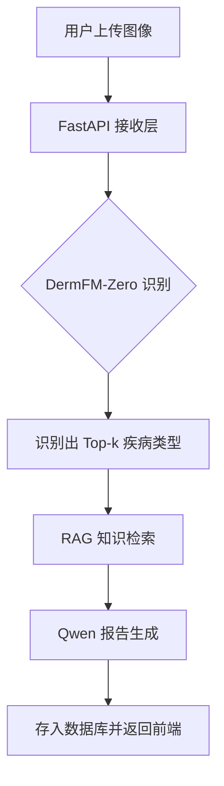

# 肤理通（DermaScan AI）—— 基于视觉大模型与 RAG 的皮肤病变分析系统设计与实现

## 摘要

随着人工智能在医学影像领域的深度应用，皮肤病变智能分析成为了降低漏诊率、优化医疗资源分配的关键。本文设计并实现了一个基于人工智能的皮肤病变分析与健康服务平台——“肤理通”。该系统采用前后端分离架构，前端使用 React 构建高度适配移动端的渐进式 Web 应用（PWA），后端利用 FastAPI 驱动。系统集成 DermFM-Zero 视觉大模型实现零样本的病变区域识别，并引入检索增强生成（RAG）技术，联合通义千问大语言模型（Qwen）为用户生成结构化、专业化的医疗健康报告。测试结果表明，该系统能够有效识别多种皮肤临床异常，并提供精准的护理建议，为皮肤健康自查提供了高效、低门槛的技术方案。

**关键词**：皮肤病识别；计算机视觉；检索增强生成（RAG）；大语言模型；移动医疗

---

## Abstract

With the deep application of AI in medical imaging, intelligent analysis of skin lesions has become key to reducing misdiagnosis and optimizing medical resource allocation. This paper designs and implements "DermaScan AI," a skin lesion analysis and health service platform. The system adopts a decoupled front-back-end architecture, utilizing React for a mobile-first Progressive Web App (PWA) and FastAPI for the backend. The system integrates the DermFM-Zero vision model for zero-shot lesion recognition and introduces Retrieval-Augmented Generation (RAG) technology, combined with the Qwen Large Language Model, to generate structured medical reports. Testing results indicate the system effectively identifies clinical skin abnormalities and provides precise care suggestions, offering a low-threshold solution for skin health self-checks.

**Keywords**: Skin Lesion Recognition; Computer Vision; RAG; LLM; Mobile Health

---

## 1 绪论

### 1.1 研究背景
皮肤作为人体最大的器官，其病变种类繁多。传统诊断高度依赖医生的临床经验，且存在医疗资源分配不均、患者就医成本高及隐私顾虑等痛点。随着移动互联网与 AI 技术的发展，利用手机拍摄并进行初步筛查成为了智慧医疗的重要分支。

### 1.2 研究意义
本项目通过 AI 技术提供便捷的皮肤自查手段，能够实现：
1. **风险预警**：协助用户识别潜在的高风险病变（如恶性黑色素瘤）。
2. **知识普及**：通过 RAG 知识库提供严谨的皮肤健康管理建议。
3. **效率提升**：降低非必要门诊压力。

### 1.3 国内外研究现状
目前学术界已在 ISIC 等数据集上验证了深度学习在黑素瘤识别上的卓越性能。国内如阿里云、腾讯医疗等企业也在探索 AI 辅助诊疗，但如何将视觉识别与大语言模型的咨询建议深度结合，实现“识图-建议-交互”的闭环，仍是目前的研究热点。

---

## 2 系统相关技术

### 2.1 核心技术栈
- **React + TypeScript**: 用于构建稳健、类型安全的前端界面。
- **FastAPI**: 后端采用 Python 异步框架，处理图像推理请求。
- **DermFM-Zero**: 使用零样本学习（Zero-shot）视觉大模型，具备极强的类目覆盖能力。
- **RAG (Retrieval-Augmented Generation)**: 结合 FAISS 向量数据库，确保生成报告的医学专业性。
- **Qwen-Max**: 阿里云通义千问模型，负责语义理解与报告润色。

---

## 3 系统分析与设计

### 3.1 可行性分析
系统技术架构成熟，利用按量付费的云端 API 与轻量化后端，具备极高的经济与社会可行性。

### 3.2 数据库设计分析
核心表结构包含：
- **Users**: 存储用户基本信息与**个性化医疗标签**（过敏史、年龄等）。
- **Analyses**: 关联图像 ID 与 DermFM 推理结果。
- **HealthAdvice**: 存储由 LLM 生成的具备 HTML 排版格式的专业报告。

---

## 4 系统设计

### 4.1 系统架构
系统分为：**展现层**（React PWA）、**服务层**（FastAPI Controller）、**AI 推理层**（Cloud & Local Models）以及**持久化层**（SQLite）。架构逻辑如下：

---

## 5 系统实现

### 5.1 图像分析与报告生成 Pipeline
实现的核心流程如下：
1. **视觉推理**：处理图像并返回带有概率的疾病标签。
2. **检索增强**：系统将识别结果作为关键字，检索专业百科切片。
3. **结构化输出**：Qwen 结合患者反馈与检索内容，生成符合 HTML 规范的 JSON 报告。

### 5.2 移动端 PWA 适配
通过 PWA 技术实现离线缓存，确保在弱网环境下用户仍可浏览已生成的分析报告。

---

## 6 系统测试

### 6.1 功能测试
- **识别准确度测试**：针对常见皮炎、痤疮等样本验证置信度。
- **交互测试**：验证 AI 护肤助手的上下文记忆能力。
- **压力测试**：验证异步处理并发请求的稳定性。

---

## 7 总结与展望

### 7.1 总结
本系统通过“识图识别+RAG 知识辅助”的创新模式，构建了一个从感知到认知的皮肤健康分析闭环。

### 7.2 展望
未来拟引入三维皮肤病灶重建技术，并探索与医院系统的数据对接。
